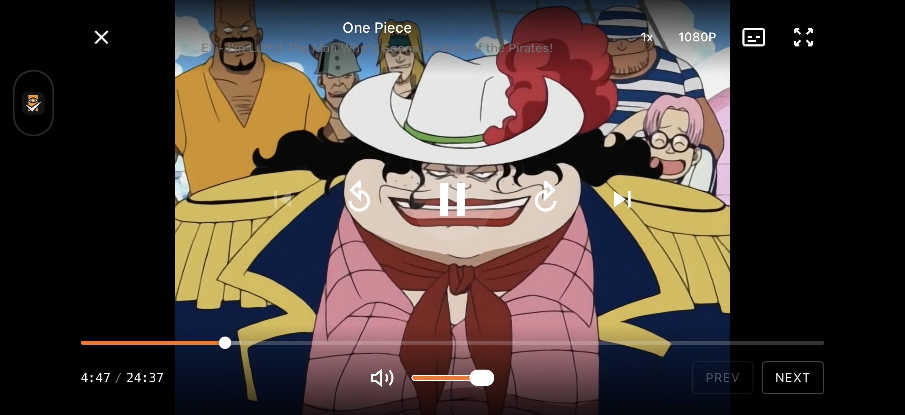
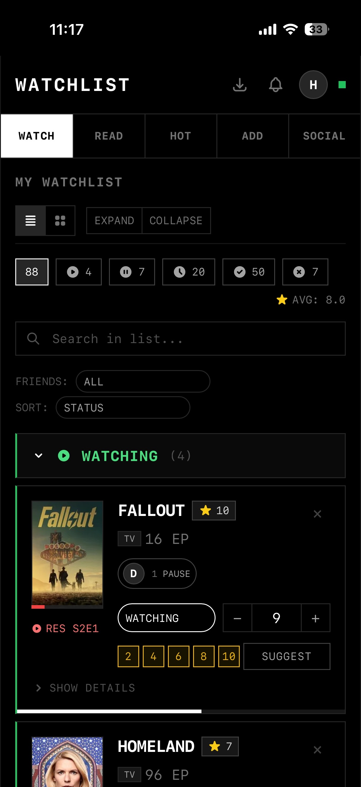
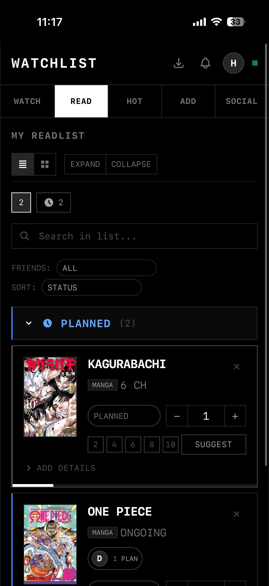
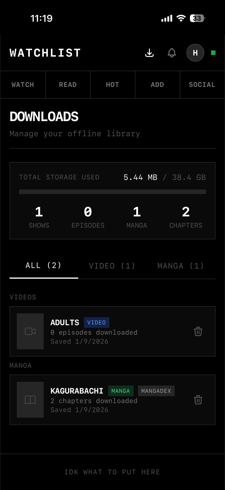

# Watchlist

Watchlist is a progressive web application (PWA) designed for tracking, streaming, and reading media content. It unifies movies, TV shows, anime, and manga into a single interface with robust offline capabilities, social features, and content aggregation from various third-party providers.

## Interface Preview

| Streaming Interface | Watchlist UI |
|:---:|:---:|
|  |  |

| Readlist UI | Download Manager | Reader Interface |
|:---:|:---:|:---:|
|  |  |  |

## Features

*   **Unified Tracking:** Manage watchlists and readlists for movies, TV series, anime, and manga in one location.
*   **Content Aggregation:** Resolves content against multiple third-party providers (e.g., TMDB, AniList, MangaDex) to find streaming sources and chapter pages.
*   **Offline Capability:**
    *   **Video:** Downloads HLS streams and MP4s using chunked storage in IndexedDB to bypass browser storage limits.
    *   **Manga:** Downloads chapters and covers for offline reading.
    *   **PWA:** Service Worker integration for offline application access.
*   **Media Player:** Custom-built video player supporting HLS playback, subtitles, quality selection, and playback speed control.
*   **Manga Reader:** Integrated reader with support for single page, double page, and long-strip reading modes.
*   **Social Interaction:**
    *   Public user profiles.
    *   Friend system with activity feeds.
    *   Media suggestion system.
*   **Background Synchronization:** Syncs watch progress and list status between local storage and the backend database.

## Architecture

The project follows a client-server architecture with a shared module for common types and utilities.

### Frontend
*   **Framework:** React 19 with TypeScript.
*   **Build Tool:** Vite.
*   **State Management:** React Context API (Auth, Offline, Toast).
*   **Storage:** IndexedDB (via extensive custom wrappers) for large binary media storage; LocalStorage for user preferences.
*   **Styling:** Tailwind CSS.
*   **Routing:** React Router DOM.

### Backend
*   **Runtime:** Node.js.
*   **Framework:** Express.
*   **Database:** PostgreSQL with Prisma ORM.
*   **Authentication:** JWT (JSON Web Tokens) with refresh token rotation.
*   **Proxy:** Handles CORS and referrer manipulation for third-party media sources.

## Prerequisites

*   Node.js 20+
*   Docker and Docker Compose
*   PostgreSQL (if running without Docker)

## Installation and Setup

### Using Docker (Recommended)

1.  Clone the repository.
2.  Create a `.env` file based on the environment variables section below.
3.  Build and run the containers:

```bash
docker-compose up -d --build
```

The application will be available at:
*   Frontend: `http://localhost:80`
*   Backend API: `http://localhost:3201`

### Manual Setup

**Backend:**

1.  Navigate to the backend directory.
2.  Install dependencies: `npm install`.
3.  Set up the database: `npx prisma generate && npx prisma migrate deploy`.
4.  Start the server: `npm run start`.

**Frontend:**

1.  Navigate to the frontend directory.
2.  Install dependencies: `npm install`.
3.  Start the development server: `npm run dev`.

## Environment Variables

Create a `.env` file in the root directory.

### Backend Variables
| Variable | Description |
|----------|-------------|
| `PORT` | API server port (default: 3201) |
| `DATABASE_URL` | PostgreSQL connection string |
| `JWT_SECRET` | Secret key for access token generation |
| `JWT_REFRESH_SECRET` | Secret key for refresh token generation |
| `TMDB_API_KEY` | API key for The Movie Database |

### Frontend Variables
| Variable | Description |
|----------|-------------|
| `VITE_API_URL` | URL of the backend API |
| `VITE_TMDB_API_KEY` | API key for TMDB (client-side operations) |
| `VITE_FRONTEND_URL` | URL where the frontend is hosted |

## Deployment

The project includes a multi-stage `Dockerfile` capable of building both the frontend (served via Nginx or Node SSR) and the backend.

The `docker-compose.yml` configures:
1.  **Backend:** Node.js application.
2.  **Frontend:** Nginx serving the Vite build.
3.  **Traefik:** Reverse proxy for routing and load balancing.
4.  **Health Checks:** Configured for both services to ensure uptime.

To deploy updates:

```bash
docker-compose pull
docker-compose up -d --remove-orphans
```

## License
 